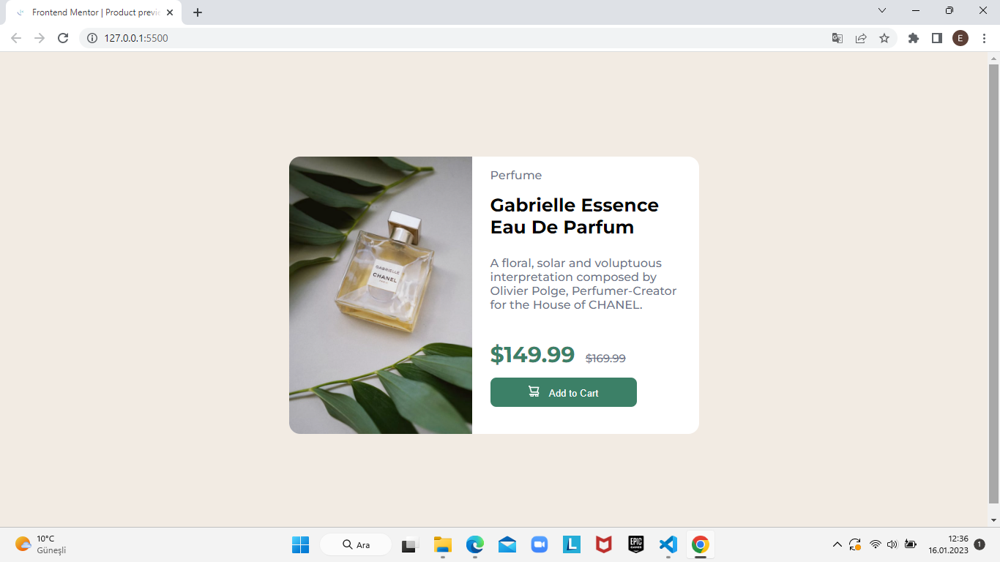

# Frontend Mentor - Product preview card component solution

This is a solution to the [Product preview card component challenge on Frontend Mentor](https://www.frontendmentor.io/challenges/product-preview-card-component-GO7UmttRfa). Frontend Mentor challenges help you improve your coding skills by building realistic projects. 

## Table of contents

- [The challenge](#the-challenge)
- [Screenshot](#screenshot)
- [Links](#links)
- [My process](#my-process)
  - [Built with](#built-with)
- [Author](#author)

### The challenge

Users should be able to:

- View the optimal layout depending on their device's screen size
- See hover and focus states for interactive elements

### Screenshot

### Links

- Solution URL: [My solution](https://www.frontendmentor.io/solutions/product-preview-card-component-02IQuoWmdl)
- Live Site URL: [Live site](https://product-card-zeta-seven.vercel.app/)

### Built with

- Semantic HTML5 markup
- CSS custom properties
- Flexbox
- CSS Grid

## Author

- Frontend Mentor - [@Abou1205](https://www.frontendmentor.io/profile/Abou1205)
- Linkedln - [Ebubekir Yılmaz](https://www.linkedin.com/in/ebubekir-yilmaz/)
# product-card
# Product-card
